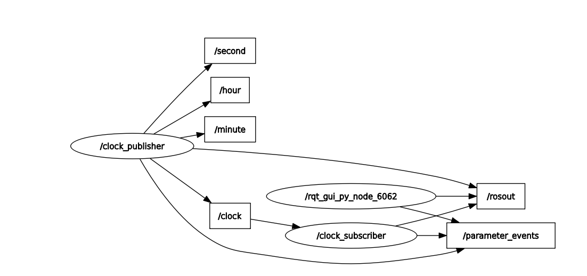

## 📁 Code Structure

| Question | File Name                      | Description                                                                 |
|----------|--------------------------------|-----------------------------------------------------------------------------|
| Q1       | `q1_publisher.py`             | Publishes "Hello World !" on `/new` topic at 15 Hz.                         |
| Q1       | `q1_subscriber.py`           | Subscribes to `/new` and prints messages to the terminal.                  |
| Q2       | `q2_signal_publisher.py`     | Publishes "green" on `/s1` for 10 seconds, then "red" continuously.        |
| Q2       | `q2_signal_switcher.py`      | Subscribes to `/s1` and publishes inverse ("red"/"green") to `/s2`.        |
| Q3       | `q3_rover_publisher.py`      | Publishes rover velocity, pose, battery, distance, and travel time using a custom message. |
| Q3       | `msg/RoverStatus.msg`        | Custom message definition used in Q3.                                       |
| Q4       | `q4_clock_publisher.py`      | Publishes time (HH:MM:SS) on `/clock` based on counters `/second`, `/minute`, and `/hour`. |
| Q4       | `q4_clock_subscriber.py`     | Subscribes to `/clock` and logs the formatted time to ensure it appears in RQT Graph. |

---

## 🖼️ RQT Graph for Question 4

This image shows the node `/clock_publisher` publishing to the following topics:
- `/second`
- `/minute`
- `/hour`
- `/clock`

And another node `/clock_subscriber` subscribes to `/clock`.

> ⚠️ Note: RQT Graph only shows publisher–subscriber relationships when both are active.

### 📷 Screenshot:

---

